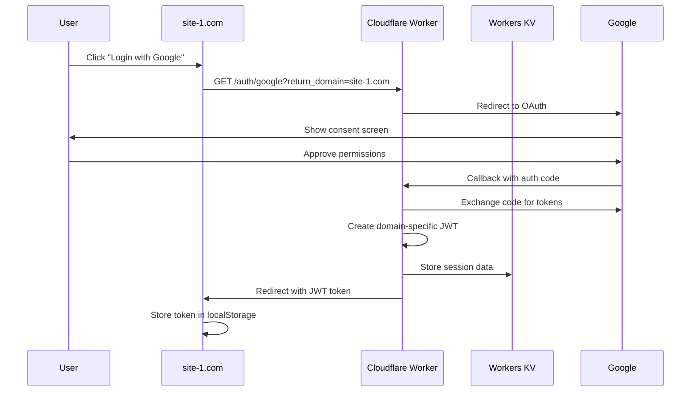

# Multi-Domain Marketplace with Cloudflare Workers

This project demonstrates a **pure Cloudflare Workers** implementation of a multi-domain marketplace with centralized authentication, payment processing, and third-party integrations. Each domain maintains complete session isolation while sharing the same powerful backend infrastructure.

## 🏗️ Architecture Overview

```
┌─────────────────┐    ┌──────────────────┐    ┌─────────────────┐
│   site-1.com    │    │ Cloudflare Edge  │    │   Workers KV    │
│   site-2.com    │───▶│    Network       │───▶│   Database      │
│ custom-domains  │    │ (300+ locations) │    │                 │
└─────────────────┘    └──────────────────┘    └─────────────────┘
```

### Components:

1. **Frontend (Next.js + Cloudflare Pages)**: Single project serving multiple custom domains
2. **Backend (Cloudflare Workers)**: Handles OAuth flows, payments, and API endpoints at the edge
3. **Storage (Workers KV)**: Distributed key-value storage for sessions, products, and analytics
4. **Third-party Integrations**:
   - **Google Sheets** (OAuth-based)
   - **Airtable** (OAuth-based with API key fallback)
   - **Stripe** (Full payment processing and subscriptions)

## 🚀 Quick Start

### 1. Prerequisites

```bash
# Install Wrangler CLI
npm install -g wrangler

# Login to Cloudflare
wrangler login

# Verify login
wrangler whoami
```

### 2. Setup Project

```bash
# Clone repository (if not already done)
git clone <your-repo>
cd multi-domain-marketplace

# Install dependencies
npm install

# Set up KV namespaces automatically
npm run setup:kv
```

### 3. Configure Environment Variables

```bash
# Google OAuth (required)
wrangler secret put GOOGLE_CLIENT_ID
wrangler secret put GOOGLE_CLIENT_SECRET

# JWT Secret (generate with: node -e "console.log(require('crypto').randomBytes(32).toString('hex'))")
wrangler secret put JWT_SECRET

# Stripe (for payments)
wrangler secret put STRIPE_SECRET_KEY
wrangler secret put STRIPE_PUBLISHABLE_KEY

# Airtable OAuth (optional)
wrangler secret put AIRTABLE_CLIENT_ID
wrangler secret put AIRTABLE_CLIENT_SECRET
```

### 4. Deploy to Cloudflare

```bash
# Deploy to development
npm run worker:deploy

# Deploy to production
npm run worker:deploy:prod
```

### 5. Configure Custom Domains

See [CLOUDFLARE_SETUP.md](./CLOUDFLARE_SETUP.md) for detailed domain configuration instructions.

## 🎯 Why Cloudflare Workers?

### Performance Benefits

- **<1ms Cold Starts**: Instant response times globally
- **300+ Edge Locations**: Your code runs everywhere
- **No Server Management**: Zero infrastructure overhead

### Cost Benefits

- **10x Cheaper**: Pay only for requests, not idle time
- **No Backend Server**: Eliminate Express.js hosting costs
- **Included Bandwidth**: Free CDN and DDoS protection

### Scalability Benefits

- **Unlimited Domains**: Add custom domains instantly
- **Auto-scaling**: Handles traffic spikes automatically
- **Global Distribution**: Low latency worldwide

## 🔧 Configuration

### KV Namespaces

The system uses four KV namespaces:

| Namespace       | Purpose                      | TTL        |
| --------------- | ---------------------------- | ---------- |
| `USER_SESSIONS` | JWT tokens and user sessions | 24 hours   |
| `PRODUCTS`      | Stripe product metadata      | Permanent  |
| `ORDERS`        | Order history and analytics  | Permanent  |
| `OAUTH_STATES`  | OAuth flow state management  | 10 minutes |

### Environment Variables

| Variable                 | Required | Purpose                       |
| ------------------------ | -------- | ----------------------------- |
| `GOOGLE_CLIENT_ID`       | ✅       | Google OAuth authentication   |
| `GOOGLE_CLIENT_SECRET`   | ✅       | Google OAuth authentication   |
| `JWT_SECRET`             | ✅       | JWT signing (256-bit minimum) |
| `STRIPE_SECRET_KEY`      | ✅       | Stripe payment processing     |
| `STRIPE_PUBLISHABLE_KEY` | ✅       | Stripe frontend integration   |
| `OAUTH_REDIRECT_URL`     | ✅       | Single OAuth redirect URL     |
| `AIRTABLE_CLIENT_ID`     | ❌       | Airtable OAuth (optional)     |
| `AIRTABLE_CLIENT_SECRET` | ❌       | Airtable OAuth (optional)     |

## 🔐 Authentication Flows

### Google OAuth (Primary Authentication)



### Domain Isolation

Each domain gets its own isolated session:

- ✅ Login on `site-1.com` ≠ logged in on `site-2.com`
- ✅ JWTs contain domain binding
- ✅ Session data stored per domain
- ✅ No cross-domain session sharing

## 🛠️ API Endpoints

### Authentication

- `GET /auth/google` - Initiate Google OAuth
- `GET /auth/google/callback` - Handle OAuth callback
- `GET /auth/airtable` - Initiate Airtable OAuth
- `GET /auth/airtable/callback` - Handle Airtable callback
- `POST /api/verify-token` - Validate JWT tokens

### Integrations

- `POST /api/sheets/create` - Create Google Sheets
- `POST /api/airtable/bases` - List Airtable bases
- `POST /api/airtable/tables` - List tables in base
- `POST /api/airtable/create-record` - Create records

### Payments (Stripe)

- `GET /api/stripe/config` - Get publishable key
- `POST /api/stripe/create-product` - Create products
- `POST /api/stripe/products` - List domain products
- `POST /api/stripe/create-payment-intent` - Process payments
- `POST /api/stripe/create-subscription` - Handle subscriptions

## 📁 Project Structure

```
├── src/
│   ├── worker.js                 # Main Cloudflare Worker
│   ├── api-handlers.js          # API endpoint implementations
│   ├── pages/
│   │   ├── _app.tsx             # Next.js app wrapper
│   │   └── index.tsx            # Main marketplace page
│   ├── components/
│   │   ├── AuthComponent.tsx    # Authentication UI
│   │   ├── AirtableForm.tsx     # Airtable integration
│   │   └── StripeComponent.tsx  # Payment processing
│   └── utils/
│       └── indexedDB.ts         # Client-side storage
├── scripts/
│   └── setup-kv-namespaces.js  # Automated KV setup
├── wrangler.toml                # Cloudflare configuration
├── CLOUDFLARE_SETUP.md          # Detailed setup guide
└── README.md                    # This file
```

## 🚀 Development

### Local Development

```bash
# Start Next.js development server
npm run dev

# Start Cloudflare Worker development server
npm run worker:dev

# View real-time logs
npm run worker:tail
```

### Testing Multi-Domain Locally

```bash
# Test different domains using curl
curl -H "Host: testdomain.com" http://localhost:8787/

# Or modify your /etc/hosts file:
# 127.0.0.1 testdomain1.local
# 127.0.0.1 testdomain2.local
```

## 📊 Performance Monitoring

### Built-in Analytics

Cloudflare provides comprehensive analytics:

- Request volume and performance
- Error rates and status codes
- Geographic distribution
- Cache hit ratios

### Custom Metrics

```javascript
// Track business metrics in Workers
await env.ANALYTICS.put(
  `metric:${domain}:${event}`,
  JSON.stringify({
    timestamp: Date.now(),
    value: amount,
    user: userId,
  })
);
```

## 🎯 Use Cases

This architecture is perfect for:

- **SaaS Marketplaces**: Like Gumroad, enabling creators to sell on custom domains
- **White-label Platforms**: Branded experiences for different customers
- **Multi-tenant Applications**: Isolated data and sessions per tenant
- **Global Marketplaces**: Low-latency worldwide with edge computing
- **High-traffic Sites**: Auto-scaling with zero server management

## 🔧 Advanced Features

### Rate Limiting

```javascript
const key = `ratelimit:${domain}:${ip}`;
const requests = (await env.RATE_LIMIT.get(key)) || 0;
if (requests > 100) {
  return new Response("Rate limited", { status: 429 });
}
```

### A/B Testing

```javascript
const variant = Math.random() < 0.5 ? "A" : "B";
const response = await handleRequest(request, variant);
```

### Real-time Analytics

```javascript
await env.ANALYTICS.put(
  `event:${domain}:purchase`,
  JSON.stringify({
    amount: 100,
    timestamp: Date.now(),
    userId: user.id,
  })
);
```

## 🐛 Troubleshooting

### Common Issues

1. **"Namespace not found"**: Run `npm run setup:kv` to create KV namespaces
2. **"Secret not found"**: Set secrets using `wrangler secret put VARIABLE_NAME`
3. **OAuth errors**: Update redirect URIs in Google/Airtable consoles
4. **Domain not working**: Check DNS CNAME records point to Cloudflare

### Debug Commands

```bash
# View worker logs in real-time
wrangler tail

# List KV namespaces
wrangler kv:namespace list

# Check secret values (they won't show the actual value)
wrangler secret list
```

## 💰 Cost Comparison

| Metric                  | Vercel + Express | Cloudflare Workers |
| ----------------------- | ---------------- | ------------------ |
| Monthly Base Cost       | $20-50           | $5                 |
| Per Request             | $0.000006        | $0.000015          |
| Backend Server          | $25-100/month    | $0                 |
| SSL Certificates        | Manual/paid      | Free               |
| **Total (1M requests)** | **$45-120**      | **$5-15**          |

## 📚 Learn More

- [Cloudflare Workers Documentation](https://developers.cloudflare.com/workers/)
- [Workers KV Documentation](https://developers.cloudflare.com/workers/runtime-apis/kv/)
- [Cloudflare for SaaS](https://developers.cloudflare.com/cloudflare-for-platforms/)
- [Detailed Setup Guide](./CLOUDFLARE_SETUP.md)

## 🤝 Contributing

1. Fork the repository
2. Create a feature branch
3. Test your changes with `wrangler dev`
4. Submit a pull request

## 📄 License

MIT License - Build amazing marketplaces on Cloudflare's global network! 🚀
